# PhotoExhibition

<div align="center">
  <h1>🏆 摄影作品展示平台</h1>
  <p><strong>基于深度学习的智能照片管理与展示系统</strong></p>
  <p>
    <a href="#-核心特性">核心特性</a> •
    <a href="#-快速开始">快速开始</a> •
    <a href="#-技术架构">技术架构</a> •
    <a href="#-ai-智能评分系统">AI评分</a>
  </p>
</div>

---

## 📋 项目简介

PhotoExhibition 是一个优雅的在线摄影作品展示平台，专为摄影师和摄影爱好者设计。通过智能AI技术，将您的摄影作品以美观、易用的方式在线发布和分享。

### 🎯 核心价值

- **优雅展示**：精心设计的界面，将您的摄影作品以最佳方式呈现
- **智能组织**：AI自动识别和分类照片，让浏览体验更加流畅自然
- **快速分享**：一键发布相册，随时随地与朋友和家人分享精彩瞬间
- **专业品质**：支持高清预览、EXIF信息展示，展现专业摄影水准

---

## ✨ 核心特性

### 🤖 AI 智能识别

- **人脸检测**：基于 RetinaFace ONNX 模型，支持置信度、面积、长宽比等多重过滤
- **人脸识别**：集成 R50/R100 嵌入模型，生成 512 维人脸特征向量
- **智能聚类**：多层阈值聚类算法，自动聚合相似人脸，支持人工确认与干预
- **场景感知**：基于路径层级的相似度阈值调整，优化套图场景识别
- **自动标注**：AI 自动为照片添加相关标签，便于浏览和搜索

### 🎭 AI 增强分析

- **场景识别**：智能识别照片场景类型（婚礼、毕业典礼、生日派对、旅行等）
- **情感分析**：基于图像特征分析照片传达的情感色彩（快乐、悲伤、温暖、安宁等）
- **相似照片搜索**：多维度相似性匹配（颜色、标签、人脸、相册），智能推荐相似照片
- **深度内容理解**：结合场景、情感等多重AI分析，提供更丰富的照片洞察

### 🧠 AI 智能评分系统

PhotoExhibition 集成了AI图像分析技术，为每张照片提供专业级的质量评估和改进建议。

#### 🎯 核心评分维度

- **技术质量评分** (40%)：分辨率、EXIF信息、色彩分析、ISO优化
- **构图美学评分** (35%)：黄金比例、焦点位置、显著性检测、规则构图
- **主题吸引力评分** (25%)：场景吸引力、人脸检测、标签丰富度、情感共鸣

#### 🚀 智能分析特性

- **全面质量评估**：三大维度综合评分
- **优点与不足识别**：自动分析照片的强项和改进空间
- **个性化改进建议**：基于AI分析提供针对性拍摄建议
- **实时评分展示**：照片查看器中直观显示评分结果
- **批量评分处理**：后台异步分析海量照片

#### ⚡ 性能优势

- **本地化处理**：ONNX Runtime本地推理，无网络依赖
- **异步处理**：后台批量分析，不影响用户体验
- **智能缓存**：Redis缓存，提升响应速度
- **降级策略**：ONNX不可用时自动使用基础评分算法

### 👥 人物相册

- **智能聚类算法**：基于 RetinaFace + InsightFace，支持多层阈值聚类（0.1-0.9 可调）
- **双面板界面**：
  - 左侧：自适应网格显示人物和聚类，支持拖拽调整宽度
  - 右侧：四级标签页（已确认/相似推荐/套图推荐/未分配）
- **交互功能**：就地编辑姓名、相似人物推荐、一键合并、备注管理
- **套图推荐**：基于同一文件夹的场景感知匹配
- **隐私保护**：支持对敏感内容进行适当的管理

### 🖼️ 图像处理与展示

- **三级缩略图系统**：400×400（封面）/800×800（瀑布流）/1920×1920（高清预览）
- **智能压缩**：WebP 格式 + 自适应质量控制，平衡文件大小与视觉质量
- **色彩分析**：自动提取主色调和色彩调色板，支持色彩相似性搜索
- **三类展示模式**：
  - 相册网格：智能封面拼图（左侧竖图 + 右侧上下横图）
  - 瀑布流：响应式布局（1-4列自适应），无限滚动加载
  - 随机模式：质量筛选的高分照片推荐
- **多维度筛选**：标签/EXIF/色彩/质量组合筛选，实时预览

### 🖼️ 人物照片智能抠图展示

人物详情页引入创新的交互式抠图展示功能：

- **AI智能抠图**：本地ONNX模型自动分离人物主体与背景
- **同步放大动画**：背景层与抠图层同步放大，视觉流畅
- **主体展开显示**：抠图层自动展开显示完整画面，背景保持裁切，两层始终中心对齐
- **层级保护**：悬停时提升层级防止遮挡，移开后保持至动画结束
- **性能优化**：异步处理抠图请求，支持预加载和缓存

### 📁 相册管理

- **智能聚合**：支持父子相册合并显示，自动统计和层级管理
- **氛围特效系统**：
  - 基于标签自动生成视觉特效
  - 樱花飘落、雪花纷飞、烟花绽放、流星划过等主题
  - 自定义背景色、前景色和特效配置
- **智能封面生成**：自动选择高质量照片作为封面
- **自动分类**：基于文件夹路径智能分类，第一级目录作为大类分组

### 🏷️ 标签系统

- **智能标签提取**：基于文件夹路径自动生成，过滤日期前缀
- **管理界面**：网格布局 + 实时搜索 + 批量操作 + 键盘导航
- **编辑功能**：就地编辑 + 颜色自定义 + 统计信息展示
- **主题发现**：帮您发现照片中的共同主题和拍摄系列

---

## 图片预览
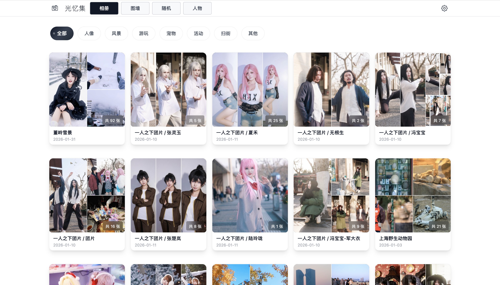

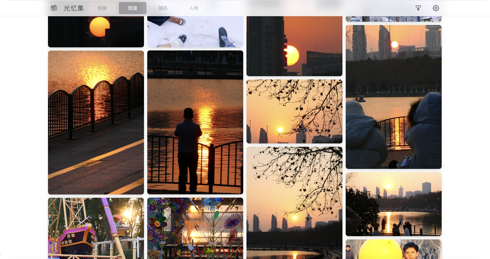

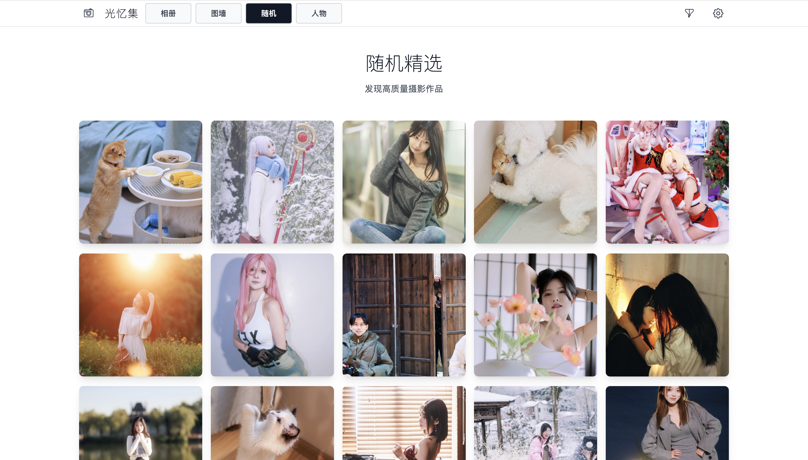


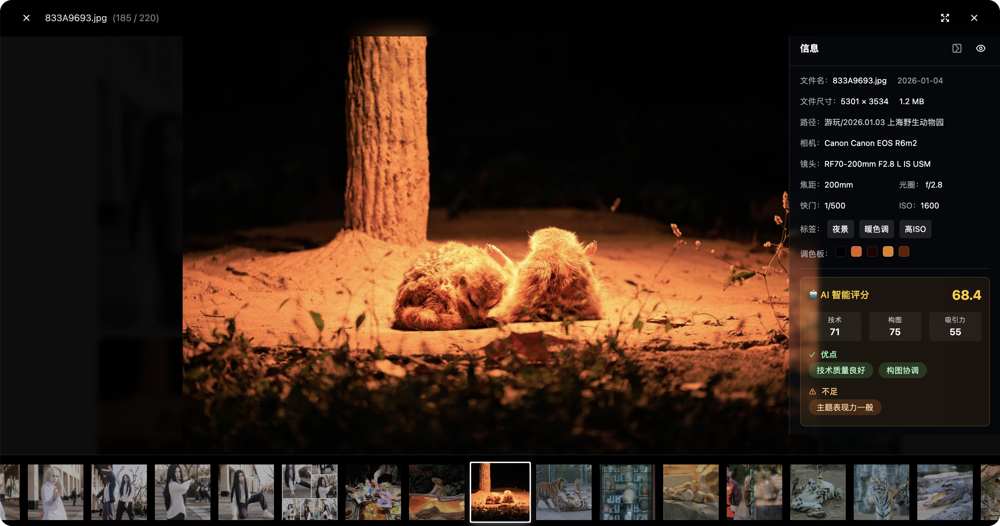

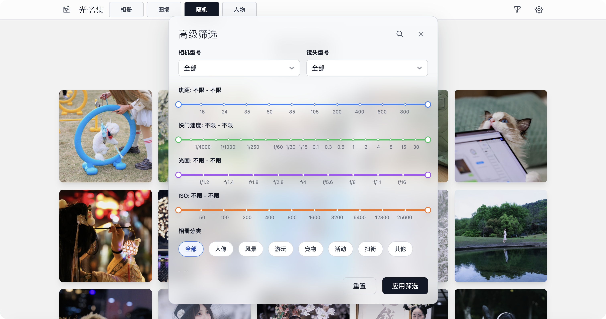

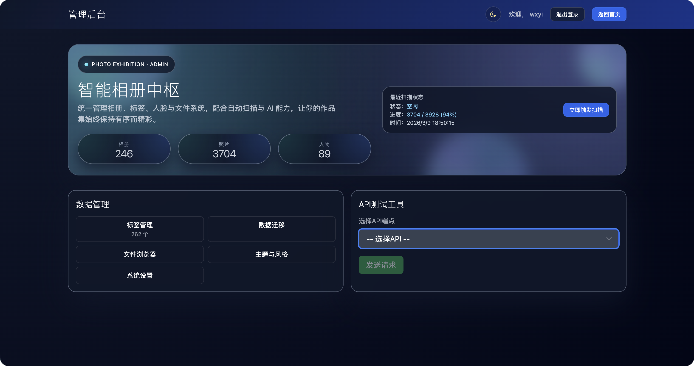

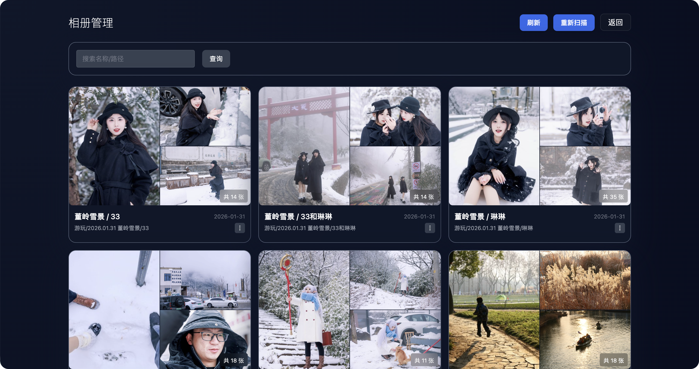

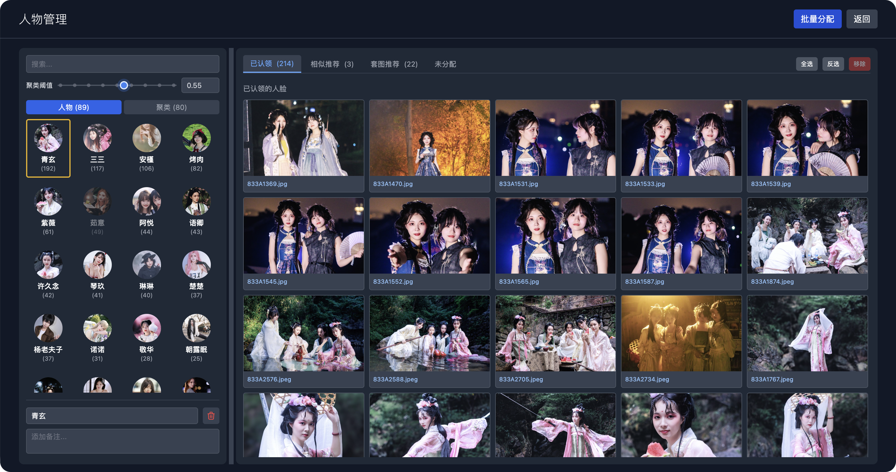

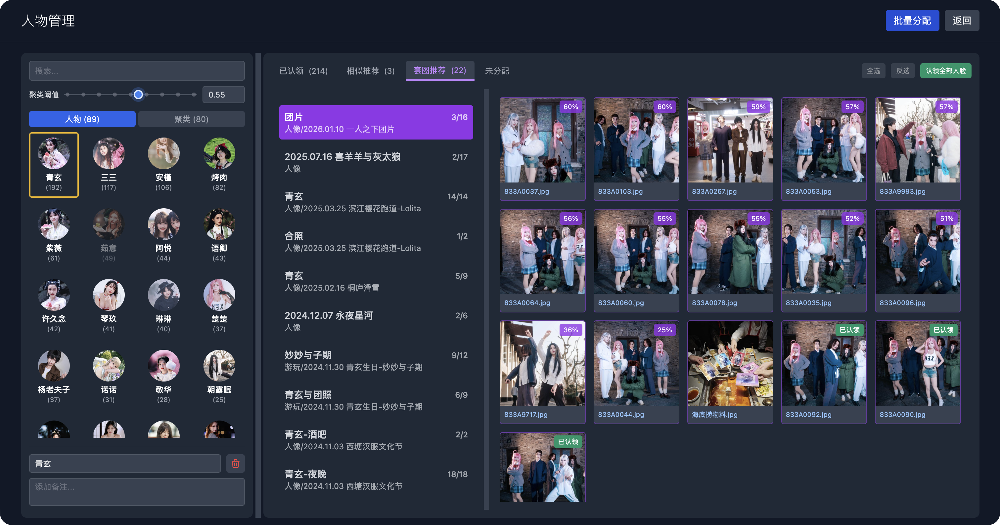

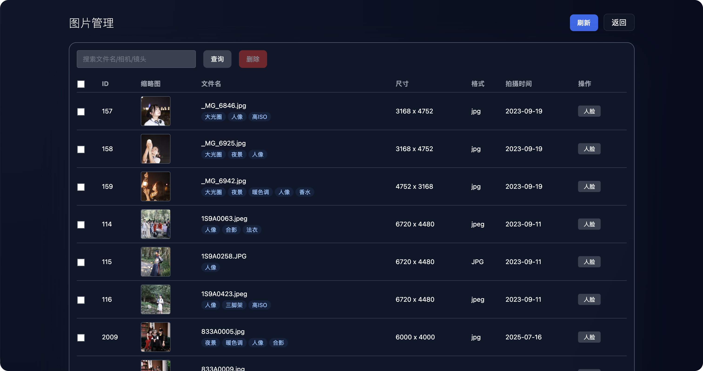

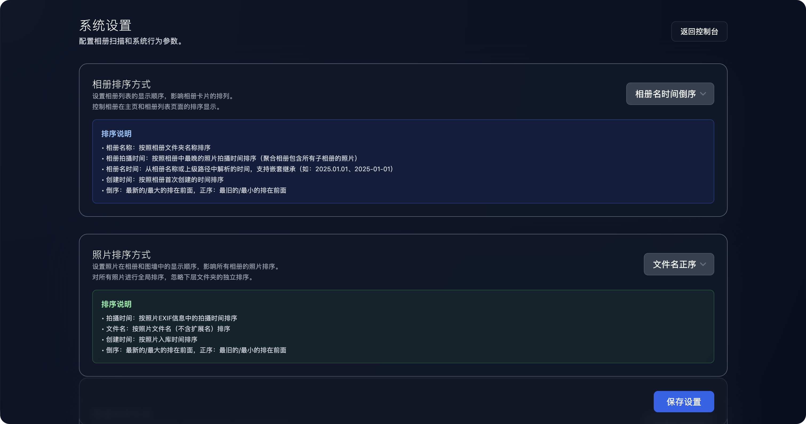

---

## 🏗️ 技术架构

#### 后端技术栈
- **Spring Boot 2.7** + Java 11 + MySQL 8.0 + Redis 7.0
- **AI 集成**：ONNX Runtime + RetinaFace + InsightFace + 图像质量评估模型
- **架构模式**：Controller → Service → Repository 分层架构

#### 前端技术栈
- **Vue 3** + TypeScript + Vite + Tailwind CSS
- **状态管理**：Pinia + Vue Router
- **UI 组件**：响应式设计 + 动画系统

#### 系统特性
- **缓存优化**：Redis 多级缓存，提升响应速度
- **异步处理**：照片扫描、人脸识别等重任务后台执行
- **智能索引**：基于 contentHash 和 pathHash 的去重机制
- **分页加载**：支持海量照片的高效分页查询
- **日志监控**：完整的日志系统和性能监控

#### 性能优化

PhotoExhibition 在数据处理层面做了深度优化，确保在面对海量照片时依然保持流畅的用户体验。

**人物相似度计算优化**

在相似推荐和未分配人脸列表的计算中，系统采用多层次优化策略：

- **计算结果缓存**：首次访问时计算并缓存人物与所有未分配人脸的相似度列表，后续访问直接命中缓存，响应时间从秒级降至毫秒级
- **缓存失效机制**：当未分配人脸总数发生变化时自动失效，确保数据一致性
- **并发控制**：使用细粒度锁防止重复计算，多人同时访问时只触发一次计算
- **并行计算**：利用多核CPU并行处理向量相似度，显著缩短首次计算时间

**向量计算加速**

- **范数预计算**：在相似度计算前预先计算目标向量的范数，避免重复的平方根运算
- **批量数据加载**：通过自定义JPQL查询一次性加载所有已确认人物的人脸数据，将N次数据库查询减少为1次
- **懒加载规避**：使用预加载关联（FETCH JOIN）避免N+1查询问题

**前端按需加载**

- **Tab页按需初始化**：相似推荐、未分配等Tab首次切换时才加载数据，减少首页渲染时间
- **状态记忆**：已加载的Tab数据在有效期内保持，避免重复请求
- **渐进式展示**：加载过程有明确的视觉反馈，操作可预期

### 🎭 PhotoViewer 交互系统

- **多点触控支持**：双指缩放和旋转，单指拖拽移动，滚轮缩放控制
- **智能缩放模式**：自适应屏幕尺寸，保持宽高比的裁剪，焦点区域高亮
- **键盘快捷键**：`←/→`切换照片，`Esc`关闭，`F`全屏，`I`信息面板
- **信息展示**：完整的 EXIF 信息、焦点框显示、人脸识别框标注
- **查看原图**：智能切换缩略图与原图显示
- **AI增强信息**：场景分类、情感分析结果展示
- **AI智能评分**：专业质量评估、优点不足分析、个性化改进建议
- **相似照片推荐**：一键查看基于AI分析的相似照片，发现更多精彩瞬间

### 🎨 动画与交互

- **FLIP 过渡动画**：从缩略图到 PhotoViewer 的无缝缩放
- **瀑布流动画**：响应式列数切换（1-4列），渐进式图片加载
- **交互反馈**：按钮悬停效果、卡片动画、复选框微交互
- **响应式设计**：毛玻璃特效、主题切换动画、自适应布局


## 🚀 快速开始

### Docker 部署
```bash
# 1. 获取项目
git clone https://github.com/your-repo/photoexhibition.git
cd photoexhibition

# 2. 组织您的照片文件
mkdir -p data/photos
# 建议的文件结构：
# data/photos/
# ├── 人像/
# │   ├── 2024.01.15 张三生日聚会/
# │   │   ├── IMG_0001.jpg
# │   │   └── IMG_0002.jpg
# │   └── 2024.02.20 李四毕业照/
# │       ├── IMG_0003.jpg
# │       └── IMG_0004.jpg
# ├── 风景/
# │   ├── 2024.03.10 樱花季/
# │   └── 2024.04.05 海边日出/
# └── 活动/
#     ├── 2024.05.01 五一劳动节/
#     └── 2024.06.15 端午节龙舟赛/

# 3. 一键启动
docker-compose up -d

# 4. 开始浏览
# 打开浏览器访问: http://localhost:3030
# 默认管理员账户: admin / admin123
```

### 📁 照片组织建议

为了获得最佳的展示效果，请按以下结构组织您的照片：

```
data/photos/
├── [分类文件夹]/          # 如：人像、风景、活动、旅行等
│   ├── [时间] [相册名称]/  # 如：2024.01.15 张三生日聚会
│   │   ├── photo1.jpg     # 照片文件
│   │   ├── photo2.jpg
│   │   └── ...
│   └── [时间] [另一个相册]/
│       └── ...
└── ...
```

#### 📋 命名规则
- **分类文件夹**：使用描述性的名称，如`人像`、`风景`、`活动`、`旅行`等
- **相册文件夹**：格式为`YYYY.MM.DD 相册描述`，日期前缀会被自动识别和剥离
- **照片文件**：支持 JPG、PNG、WebP、TIFF 等常见格式

#### 💡 使用建议
- 保持分类清晰，便于浏览和查找
- 使用有意义的相册名称，方便快速识别内容
- 同一场景的照片建议放在同一个相册中
- 系统会自动识别文件夹结构并生成相应的分类和标签

---

---


---

## ⚙️ 配置说明

### 核心配置
- **照片路径**: `photo.scan.base-path` - 照片存储目录
- **人脸识别**: `face.detection.confidence-threshold` - 检测置信度阈值
- **聚类阈值**: `face.clustering.min-threshold` - 人脸聚类相似度阈值
- **缩略图尺寸**: 三级缩略图系统（400×400/800×800/1920×1920）

### AI增强配置
- **场景识别**: `ai.scene-recognition.enabled` - 启用场景识别功能
- **情感分析**: `ai.emotion-analysis.enabled` - 启用情感分析功能
- **AI评分**: `ai.scoring.enabled` - 启用AI智能评分功能
- **评分权重**: `ai.scoring.technical-weight` - 技术质量权重 (默认0.40)
- **构图权重**: `ai.scoring.composition-weight` - 构图美学权重 (默认0.35)
- **吸引力权重**: `ai.scoring.appeal-weight` - 主题吸引力权重 (默认0.25)
- **评分版本**: `ai.scoring.version` - 评分算法版本控制

### ONNX Runtime 配置

项目支持多平台ONNX Runtime版本自动选择，以适应不同的部署环境和系统要求：

#### 平台自动检测
项目会根据操作系统和架构自动选择最适合的ONNX Runtime版本：

- **macOS ARM64** (M1/M2/M3): 自动使用1.16.3版本
- **macOS Intel**: 使用1.8.1版本
- **Windows Server 2012及更早**: 强制使用1.8.1版本（兼容性）
- **现代Windows** (Win10/11): 使用1.16.3版本
- **Linux系统**: 使用1.16.3版本

#### 手动指定版本
如果需要手动控制版本，可以使用以下方法：

```bash
# 1. 使用环境变量指定版本
ONNX_VERSION=1.8.1 mvn clean package

# 2. 使用Maven profile
mvn clean package -Plegacy-windows  # 强制1.8.1版本
mvn clean package -Pmacos-arm64     # 强制1.16.3版本

# 3. 自定义版本
mvn clean package -Pcustom-onnx -Donnx.runtime.version=1.12.0
```

#### Windows环境
```cmd
REM 让系统自动选择（推荐）
start-backend.bat

REM 强制使用兼容版本（老服务器）
set MAVEN_OPTS=-Plegacy-windows
start-backend.bat

REM 指定特定版本
set ONNX_VERSION=1.8.1
start-backend.bat
```

#### 版本兼容性说明
| 平台 | 推荐版本 | 最低版本 | 说明 |
|------|----------|----------|------|
| macOS ARM64 | 1.16.3 | 1.16.0 | 需要新版本支持 |
| macOS Intel | 1.8.1 | 1.8.0 | 兼容性良好 |
| Windows 10+ | 1.16.3 | 1.8.1 | 支持新特性 |
| Windows Server 2012 | 1.8.1 | 1.8.0 | 老系统兼容 |
| Linux | 1.16.3 | 1.8.1 | 性能优化 |

#### 实际使用示例

```bash
# 在macOS ARM64上自动选择1.16.3版本
mvn clean package  # 会自动激活macos-arm64 profile

# 在Windows Server 2012上强制使用1.8.1版本
mvn clean package -Plegacy-windows

# 在任何平台上强制指定版本
mvn clean package -Pcustom-onnx -Donnx.runtime.version=1.12.0

# 查看当前激活的profile
mvn help:active-profiles

# GPU版本（如果有CUDA支持）
mvn clean package -Pgpu
```

#### 系统要求
- **CPU版本**: Java 11+, 4GB+ RAM
- **GPU版本**: CUDA 11.0+, cuDNN, 独立显卡
- **推荐**: 服务器环境使用CPU版本，开发环境可根据硬件选择

---


---

## 🐛 故障排除

### 常见问题

#### 照片无法显示
- 检查 `photo.scan.base-path` 配置是否正确
- 确认文件权限设置
- 查看 Nginx 访问日志

#### 人脸识别不准确
- 调整检测置信度阈值
- 检查模型文件是否完整
- 验证 ONNX Runtime 版本兼容性

#### AI评分不工作
- 检查 `ai.scoring.enabled` 配置是否为 `true`
- 验证 ONNX Runtime 是否正确安装和配置
- 查看应用启动日志中的AI评分初始化信息
- 检查数据库中是否有评分结果表记录

#### 扫描性能问题
- 增加 JVM 内存分配
- 调整批处理大小
- 启用 Redis 缓存

#### ONNX Runtime 问题
需要本地安装 onnxruntime 库。
```bash
# 运行完整的ONNX Runtime诊断
curl -X POST http://localhost:6060/api/admin/diagnostics/onnx \
  -H "Authorization: Bearer YOUR_TOKEN"

# 查看详细日志
tail -f logs/application.log
```

#### 数据库连接问题
```bash
# 测试 MySQL 连接
mysql -h localhost -P 3306 -u root -p photo_exhibition

# 测试 Redis 连接
redis-cli -h localhost -p 6379 ping
```

### 日志分析

系统日志位置：
- 应用日志：`logs/application.log`
- 错误日志：`logs/error.log`
- Docker 日志：`docker-compose logs -f backend`

---


## 📄 许可证

本项目采用 **MIT License** 开源许可证。

---

## 🙏 致谢

感谢以下开源项目的支持：

- **Spring Boot**: 企业级应用框架
- **Vue.js**: 渐进式前端框架
- **InsightFace**: 人脸识别算法
- **ONNX Runtime**: 深度学习推理引擎，支持AI评分和图像分析
- **OpenCV**: 计算机视觉算法库
- **Tailwind CSS**: 实用优先的 CSS 框架

---

## 📞 联系我们

- **项目主页**: https://github.com/iwxyi/PhotoExhibition.git
- **反馈建议**: 直接发Issues
- **邮箱**: wxy@iwxyi.com

---

<div align="center">
  <p><strong>🚀 让每一张照片都被珍视，每一个瞬间都被铭记</strong></p>
  <p>Made with ❤️ by iwxyi</p>
</div>

